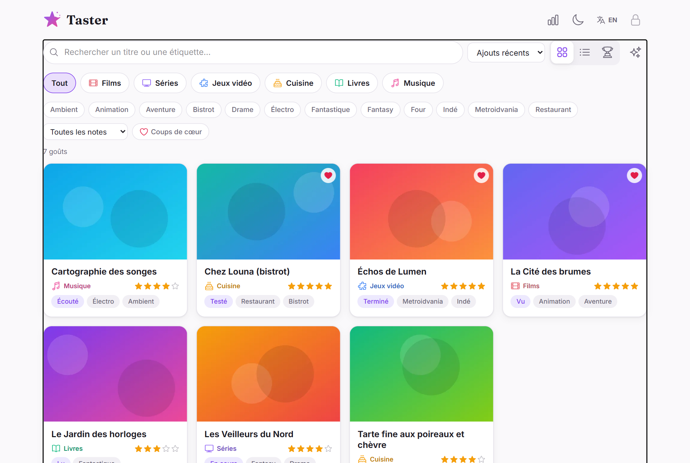
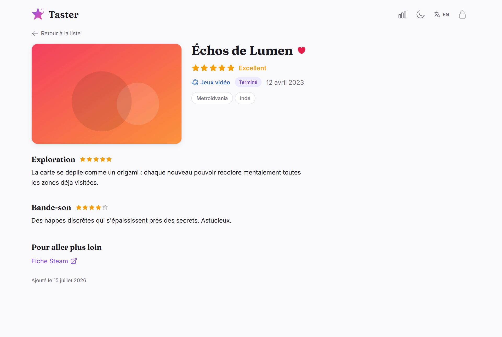

# Taster

[](./LICENSE)
[](https://github.com/qiaeru/taster/releases)
[](https://github.com/qiaeru/taster/pkgs/container/taster)
[](https://github.com/qiaeru/taster/stargazers)

A self-hosted showcase of your personal tastes. Rate, tag and review movies, TV shows, video games, restaurants and more, and share them as a beautiful filterable list.

Visitors browse a card grid they can filter by category, tag, status, rating or favorites, search instantly, and sort by rating into a tier list grouped by stars. Each taste has its own page with star ratings, a sectioned review (Markdown, with click-to-reveal spoilers), reference links, an optional map location and a "read the full review" link back to your blog. Only you edit, behind a hardened admin login.

> **Yours, entirely.** One container, one SQLite file, images stored and recompressed locally. No telemetry, no CDN, no external network call at runtime.

| List | Taste page |
| :--: | :--: |
|  |  |
| *The public list: category chips, filters, search, grid and list views* | *A taste page: ratings, tags, review sections, reference links* |

## Highlights

### What it does

- **One list for every taste.** Categories are yours to define (movies, TV shows, video games, restaurants, books and music are seeded) with their own icon, color and progress statuses (Watched, Watching or To watch for movies, Finished, Dropped or To play for games...).
- **Rich taste pages.** 1-5 star rating with labels (Terrible to Excellent), free-form tags, flexible-precision dates (year, month or day), an illustration image, GPS coordinates that open the visitor's preferred maps app, reference links (Wikipedia, IMDb...), and a review split into titled sections with optional sub-ratings, or a single link to your full review on your blog.
- **A pleasant browse.** Instant accent-insensitive search over titles and tags, contextual filters, four reversible sort orders (the rating sort renders as a tier list grouped by stars), grid and list views, a random pick button, and shareable URLs that capture the current filters.
- **Made to be shared.** Real permalinks with server-rendered OpenGraph previews (links unfurl nicely on Mastodon, Discord and friends), an Atom feed of your latest tastes, a sitemap, a public statistics page and an installable PWA.
- **Drafts and favorites.** Prepare an entry privately until its blog post ships; pin your favorites with a heart badge and a dedicated filter.
- **AI-friendly import.** Import one or many tastes from a documented JSON file (images embeddable in base64); hand the format doc to an AI assistant and paste the result. Re-importing an export updates entries in place, and full exports double as portable backups.
- **French and English** out of the box, light and dark themes, and a theming contract designed for more.

### Under the hood

- **Backend.** Node.js 24 and Fastify 5 in a single process; SQLite through the built-in `node:sqlite` module (zero database dependency), numbered SQL migrations, one `var/` volume for everything.
- **Frontend.** Vanilla TypeScript with Vite and Tailwind CSS v4, no UI framework; pages lazy-load, Markdown renders through marked + DOMPurify only where needed, Heroicons and Simple Icons bundled, Hanken Grotesk and Young Serif self-hosted.
- **Images stay light.** Every upload or imported image is validated by magic bytes and re-encoded server-side (sharp) into a ~480 px thumbnail for cards and a 1600 px WebP for the page; originals are never stored, cards lazy-load with fixed dimensions.
- **Hardened.** Argon2id passwords with a zxcvbn policy and forced first-boot change, encrypted `SameSite=Strict` session cookies, CSRF double-submit, rate limits and lockout, strict CSP, non-root container.
- **Ready for public release.** MIT licensed, license check in CI, Dependabot, GitHub Actions, multi-arch (amd64 + arm64) GHCR releases.

## Quick start

```bash
mkdir taster && cd taster
curl -O https://raw.githubusercontent.com/qiaeru/taster/main/docker-compose.yml
echo "SESSION_SECRET=$(openssl rand -base64 48)" > .env
mkdir -p var && sudo chown -R 999:999 var
docker compose up -d
```

Open <http://localhost:3000>, click the sign-in icon and sign in with `taster` / `changeme` (a new password is required immediately). Import [`data/taster-tastes-template-en.json`](./data/taster-tastes-template-en.json) from the admin to see the app populated, or create your first taste.

## HTTPS deployments

Three ready-to-use Compose variants live in [`deploy/`](./deploy/):

- [Caddy](./deploy/caddy/README.md) is the simplest option, with automatic Let's Encrypt certificates.
- [Traefik](./deploy/traefik/README.md) uses label-based routing and fits well alongside other services.
- [nginx](./deploy/nginx/README.md) is for hosts that already run nginx with their own certbot pipeline.

## Documentation

- [Architecture](./docs/architecture.md)
- [Development](./docs/development.md)
- [Deployment](./docs/deployment.md) and [configuration](./docs/configuration.md)
- [JSON import/export format](./docs/json-import.md)
- [Security](./docs/security.md)
- [Internationalization](./docs/i18n.md)
- [Accessibility](./docs/accessibility.md)

## Credits

See [CREDITS.md](./CREDITS.md) for the open-source projects Taster builds on.

## License

[MIT](./LICENSE)
